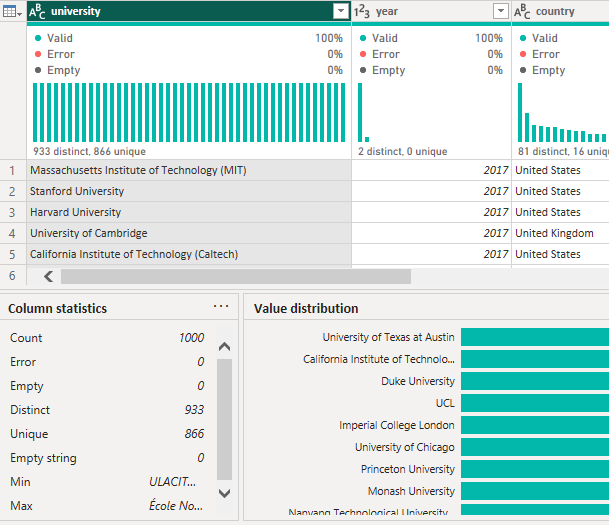
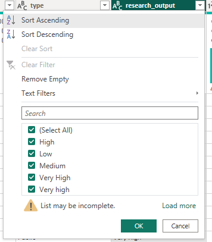
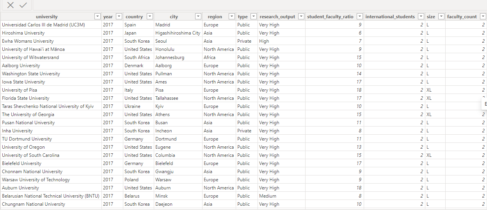

# World-University-Ranking
This is an analysis to know the factors that influences international schooling.

*The picture is from the website of freepiks*

  

## Introduction
At some point in my life, I craved an international education. I went through various websites in order to make informed decision. I finally applied to several schools, got admissions but somehow  couldnt afford the fees, hence I didnt go. Dno't feel bad, it's not uncommon :sweat_smile:

If you have funds and you are ready to make such an interesting move, then this project should help you. 
I belong to a community called ["She Code Africa"](https://shecodeafrica.org/), we decided to carry out some projects to show our skills and improve our learning. Amongst the listed projects, I chose this probably becasue of my previous expereience. 
So let's get down into it.

---
## Project Overview
It is alright to know different factors that can influence one's decision, the QS World University Rankings can be used to assist, give guidance and concentration on some particular measures before choosing a university.

In order for the UK to be able to evaluate the standing of its universities on a worldwide scale, the UK's finance ministry stressed the need for such ranking. A UK business by the name of Quacquarelli Symonds (QS) specializes in the analysis of universities all over the world. They acknowledged teaching, research, fostering employability, and internationalization as the four pillars of a university's mission. QS created its rankings to evaluate achievement in these areas.
The methodology it employs evaluates universities using six metrics:

1. Academic Reputation (40%)
2. Employer Reputation (10%)
3. Faculty/Student Ratio (20%)
4. Citations per faculty (20%)
5. International Faculty Ratio (5%)
6. International Student Ratio (5%)
More information about the methodology can be found [here](https://www.topuniversities.com/qs-world-university-rankings/methodology)

---
## Problem Statement
For this project, carry out an Exploratory Data Analysis to see what influences students to make their choices on a global scale.

---
## Skills and Concepts demonstrated:
1. Python (EDA for Data Analysis)
2. PowerBI concepts like:
 - creating columns for calculations for dates, time, and duration
 - Creating key performance indicators (KPIs) and other business calculations,
 - Developing general DAX calculations that deal with text and numbers,
 - Measures,
 - filters,
 - tooltips,
 - buttons and 
 - Data Visualization
---

## Data Source:
Data is gotten from Kaggle, view it [here.](https://www.kaggle.com/datasets/padhmam/qs-world-university-rankings-2017-2022). The dataset has a total of 15 columns of data for 2017 - 2022.

It has the following attributes or fields labelled as "columns":

 - university - name of the university
 - year - year of ranking
 - rank_display - rank given to the university
 - score - score of the university based on the six key metrics mentioned above
 - link - link to the university profile page on QS website
 - country - country in which the university is located
 - city - city in which the university is located
 - region - continent in which the university is located
 - logo - link to the logo of the university
 - type - type of university (public or private)
 - research_output - quality of research at the university
 - student_faculty_ratio - number of students assigned to per faculty
 - international_students - number of international students enrolled at the university
 - size - size of the university in terms of area
 - faculty_count - number of faculty or academic staff at the university.
 
 ---
 ## Data Cleaning and Transformation
 Several cleaning processes were carried out like:
 - Removed rows that had empty values,
 - Trimmed some fields,
 - Transformed some texts
 - Removed 4 coulmns which are not useful to me (Link, Logo, Score and rank_display)
 
            |         
 
 This resulted to a clean data found below
 
 
 ---
 
 ## Data Modelling
 The data is an 
